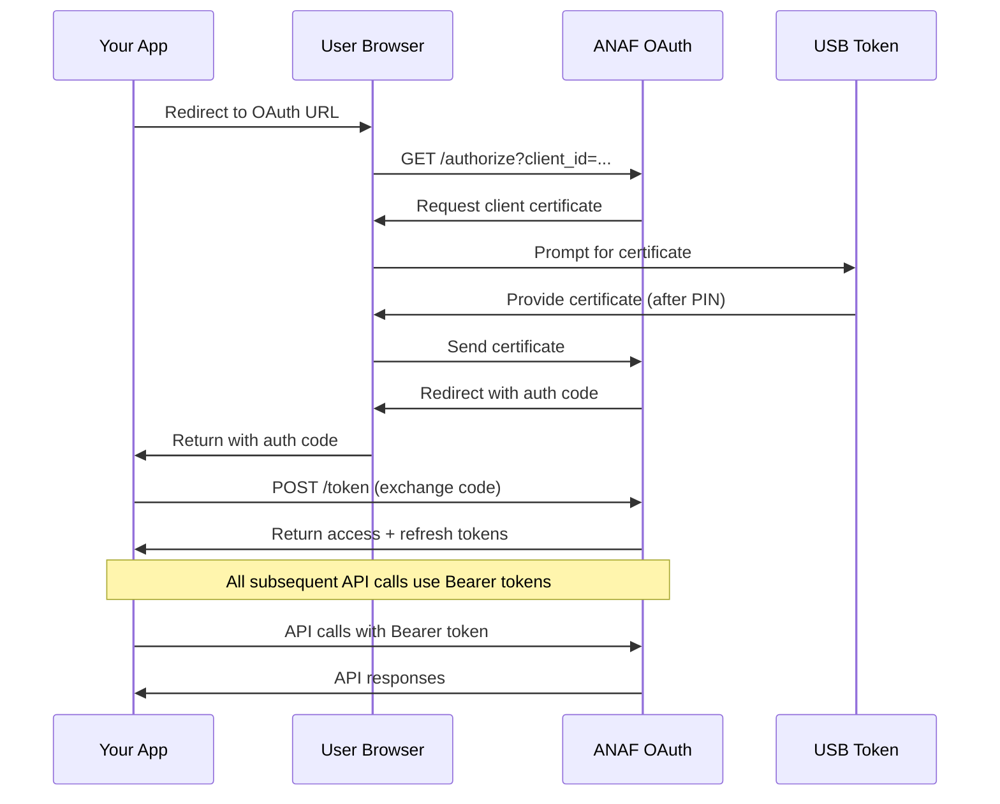

# ANAF e-Factura TypeScript SDK

Complete TypeScript SDK for Romanian ANAF e-Factura API with OAuth 2.0 authentication, UBL generation, and comprehensive API coverage.

## Features

✅ **OAuth 2.0 Authentication** - One-time setup with USB token in browser  
✅ **Complete API Coverage** - All 11 ANAF e-Factura endpoints  
✅ **UBL 2.1 Generation** - CIUS-RO compliant XML invoices  
✅ **TypeScript Support** - Full type safety and IntelliSense  
✅ **Multiple Build Targets** - CommonJS, ESM, and TypeScript declarations  
✅ **Comprehensive Testing** - Unit tests with high coverage  
✅ **Production Ready** - Error handling, validation, and debugging support  

## Quick Start

### Installation

```bash
pnpm add anaf-e-factura-sdk
```

### 1. Get OAuth Credentials

Register your application in ANAF SPV (Spațiul Privat Virtual):
1. Go to "Administrare aplicații web service"
2. Register your application
3. Get `client_id`, `client_secret`
4. Set your `redirect_uri` (e.g., `https://your-app.com/oauth/callback`)

### 2. Initialize Client

```typescript
import { AnafClient } from 'anaf-e-factura-sdk';

const client = new AnafClient({
  clientId: 'your-oauth-client-id',
  clientSecret: 'your-oauth-client-secret',
  redirectUri: 'https://your-app.com/oauth/callback',
  vatNumber: 'RO12345678',
  testMode: true // Use false for production
});
```

### 3. OAuth Authentication Flow

The authentication happens **once** (or every 90 days) when the user authenticates with their USB token in the browser:

```typescript
// Step 1: Generate authorization URL
const authUrl = client.getAuthorizationUrl('optional-state-for-security');

// Step 2: Redirect user to authUrl
// User will:
// - Go to ANAF login page
// - Browser prompts for USB token certificate
// - User inserts USB token, enters PIN
// - User authorizes your application
// - ANAF redirects back to your redirect_uri with code

// Step 3: Exchange code for tokens
const tokens = await client.exchangeCodeForToken(authorizationCode);

// Step 4: Store tokens securely
// tokens.refresh_token is valid for 90 days
// tokens.access_token is valid for ~60 minutes
```

### 4. API Calls (No USB Token Needed)

After authentication, all API calls use OAuth tokens:

```typescript
// Generate invoice XML
const xml = client.generateInvoiceXml({
  invoiceNumber: 'INV-2024-001',
  issueDate: new Date(),
  supplier: {
    registrationName: 'Company SRL',
    companyId: 'RO12345678',
    vatNumber: 'RO12345678',
    address: {
      street: 'Str. Example 1',
      city: 'Bucharest',
      postalZone: '010101'
    }
  },
  customer: {
    registrationName: 'Customer SRL',
    companyId: 'RO87654321',
    address: {
      street: 'Str. Customer 2',
      city: 'Cluj-Napoca',
      postalZone: '400001'
    }
  },
  lines: [
    {
      description: 'Professional Services',
      quantity: 1,
      unitPrice: 1000,
      taxPercent: 19
    }
  ],
  isSupplierVatPayer: true
});

// Upload to ANAF (no USB token required!)
const uploadResult = await client.uploadDocument(tokens.access_token, xml);

// Check status
const status = await client.getUploadStatus(tokens.access_token, uploadResult.index_incarcare);

// Get messages
const messages = await client.getMessages(tokens.access_token, { zile: 7, filtru: 'T' });
```

### 5. Token Refresh

Access tokens expire after ~60 minutes. Refresh them automatically:

```typescript
// When access token expires, refresh it
const newTokens = await client.refreshAccessToken(tokens.refresh_token);

// Continue using new access token
const newUpload = await client.uploadDocument(newTokens.access_token, xml);
```

## How It Works

### Authentication Flow



### Key Points

1. **USB Token Used Once**: Only during OAuth authentication in browser
2. **Tokens Last Long**: Refresh token valid for 90 days
3. **No Server Certificates**: Your server never handles certificates
4. **Standard OAuth**: Uses standard OAuth 2.0 flow
5. **Secure**: Certificate never leaves user's browser

## API Reference

### AnafClient

Main client class for ANAF e-Factura API.

#### Constructor

```typescript
const client = new AnafClient(config: AnafClientConfig);
```

#### OAuth Methods

```typescript
// Get authorization URL
getAuthorizationUrl(state?: string, scope?: string): string

// Exchange authorization code for tokens
exchangeCodeForToken(code: string): Promise<TokenResponse>

// Refresh access token
refreshAccessToken(refreshToken: string): Promise<TokenResponse>
```

#### Document Operations

```typescript
// Upload document
uploadDocument(accessToken: string, xmlContent: string, options?: UploadOptions): Promise<UploadStatus>

// Upload B2C document
uploadB2CDocument(accessToken: string, xmlContent: string): Promise<UploadStatus>

// Get upload status
getUploadStatus(accessToken: string, uploadId: string): Promise<UploadStatus>

// Download document
downloadDocument(accessToken: string, downloadId: string): Promise<string>
```

#### Message Operations

```typescript
// Get messages
getMessages(accessToken: string, params: ListMessagesParams): Promise<ListMessagesResponse>

// Get messages with pagination
getMessagesPaginated(accessToken: string, params: PaginatedMessagesParams): Promise<ListMessagesResponse>
```

#### Validation & Conversion

```typescript
// Validate XML
validateXml(accessToken: string, xmlContent: string, standard?: DocumentStandardType): Promise<ValidationResult>

// Convert XML to PDF
convertXmlToPdf(accessToken: string, xmlContent: string, standard?: DocumentStandardType, includeDiacritics?: boolean): Promise<Buffer>

// Validate digital signature
validateSignature(accessToken: string, xmlContent: string): Promise<ValidationResult>
```

#### UBL Generation

```typescript
// Generate invoice XML
generateInvoiceXml(invoiceData: InvoiceInput): string
```

## Complete Example: SaaS Application

```typescript
import express from 'express';
import { AnafClient } from 'anaf-e-factura-sdk';

const app = express();
const client = new AnafClient({
  clientId: process.env.ANAF_CLIENT_ID!,
  clientSecret: process.env.ANAF_CLIENT_SECRET!,
  redirectUri: 'https://yourapp.com/oauth/anaf/callback',
  vatNumber: 'RO12345678',
  testMode: false
});

// Step 1: Initiate OAuth flow
app.get('/auth/anaf', (req, res) => {
  const state = generateRandomState(); // Implement CSRF protection
  const authUrl = client.getAuthorizationUrl(state);
  
  // Store state for validation
  req.session.oauthState = state;
  
  res.redirect(authUrl);
});

// Step 2: Handle OAuth callback
app.get('/oauth/anaf/callback', async (req, res) => {
  try {
    const { code, state } = req.query;
    
    // Validate state parameter
    if (state !== req.session.oauthState) {
      throw new Error('Invalid state parameter');
    }
    
    // Exchange code for tokens
    const tokens = await client.exchangeCodeForToken(code as string);
    
    // Store tokens securely (encrypt in database)
    await storeUserTokens(req.user.id, tokens);
    
    res.redirect('/dashboard?connected=true');
  } catch (error) {
    res.redirect('/dashboard?error=' + encodeURIComponent(error.message));
  }
});

// Step 3: Upload invoice
app.post('/api/invoices/upload', async (req, res) => {
  try {
    const { invoiceData } = req.body;
    const userId = req.user.id;
    
    // Get stored tokens
    let tokens = await getUserTokens(userId);
    
    // Refresh if needed
    if (isTokenExpired(tokens.access_token)) {
      tokens = await client.refreshAccessToken(tokens.refresh_token);
      await storeUserTokens(userId, tokens);
    }
    
    // Generate XML
    const xml = client.generateInvoiceXml(invoiceData);
    
    // Upload to ANAF
    const result = await client.uploadDocument(tokens.access_token, xml);
    
    res.json({ success: true, result });
  } catch (error) {
    res.status(500).json({ error: error.message });
  }
});

app.listen(3000);
```

## Error Handling

The SDK provides specific error classes:

```typescript
import { 
  AnafApiError, 
  AnafAuthenticationError, 
  AnafValidationError 
} from 'anaf-e-factura-sdk';

try {
  await client.uploadDocument(accessToken, xml);
} catch (error) {
  if (error instanceof AnafAuthenticationError) {
    // Token expired or invalid - refresh token
    console.log('Authentication error:', error.message);
  } else if (error instanceof AnafValidationError) {
    // Invalid parameters
    console.log('Validation error:', error.message);
  } else if (error instanceof AnafApiError) {
    // ANAF API error
    console.log('API error:', error.message, error.statusCode);
  }
}
```

## ANAF API Endpoints Covered

| Endpoint | Method | Description |
|----------|--------|-------------|
| `/upload` | `uploadDocument()` | Upload UBL invoices |
| `/upload/b2c` | `uploadB2CDocument()` | Upload B2C invoices |
| `/stareMesaj` | `getUploadStatus()` | Check upload status |
| `/descarcare` | `downloadDocument()` | Download processed documents |
| `/listaMesaje` | `getMessages()` | Get recent messages |
| `/listaMesajePaginat` | `getMessagesPaginated()` | Get paginated messages |
| `/validare` | `validateXml()` | Validate XML documents |
| `/transformare/FACT1` | `convertXmlToPdf()` | Convert XML to PDF |
| `/transformare/FCN` | `convertXmlToPdf()` | Convert credit notes to PDF |
| `/validareUBL` | `validateSignature()` | Validate digital signatures |

## TypeScript Types

The SDK includes comprehensive TypeScript definitions:

```typescript
import type { 
  AnafClientConfig,
  TokenResponse,
  UploadStatus,
  ListMessagesResponse,
  InvoiceInput,
  ValidationResult
} from 'anaf-e-factura-sdk';
```

## Testing

```bash
# Run tests
pnpm test

# Run tests with coverage
pnpm test:coverage

# Run tests in watch mode
pnpm test:watch
```

## Building

```bash
# Build all targets
pnpm build

# Build and watch for changes
pnpm dev
```

## License

MIT License - see [LICENSE](./LICENSE) file for details.

## Contributing

1. Fork the repository
2. Create a feature branch
3. Make your changes
4. Add tests
5. Run tests and linting
6. Submit a pull request

## Support

For questions about:
- **ANAF e-Factura API**: Check [ANAF official documentation](https://www.anaf.ro/en/about-anaf/e-factura/)
- **This SDK**: Open an issue on GitHub
- **OAuth Setup**: Consult ANAF SPV documentation

---

**Perfect for**: SaaS applications, accounting software, ERP integrations, invoicing systems 